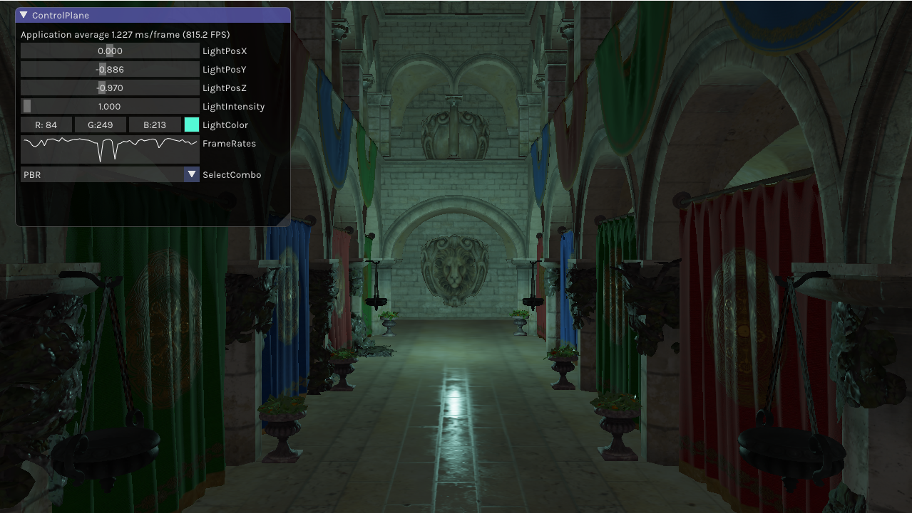
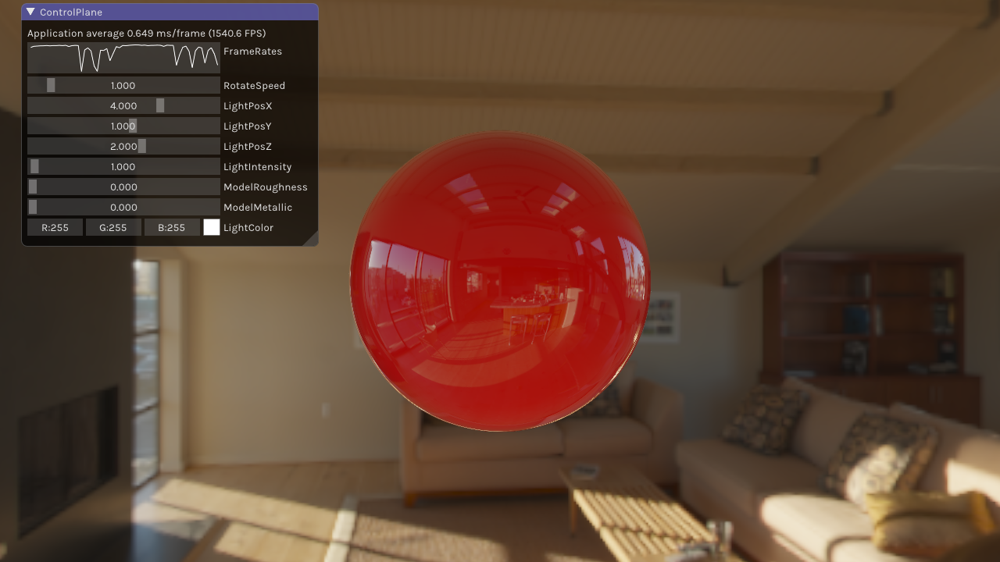
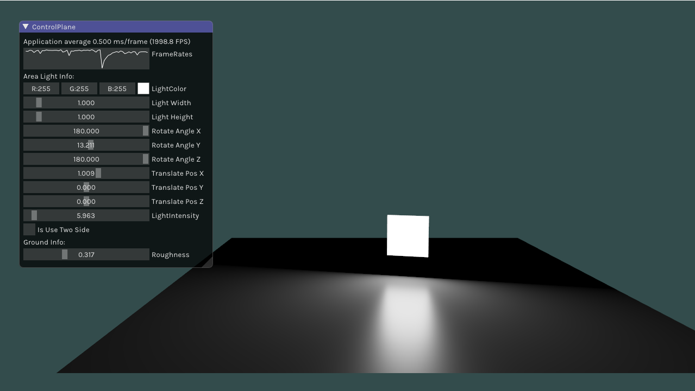
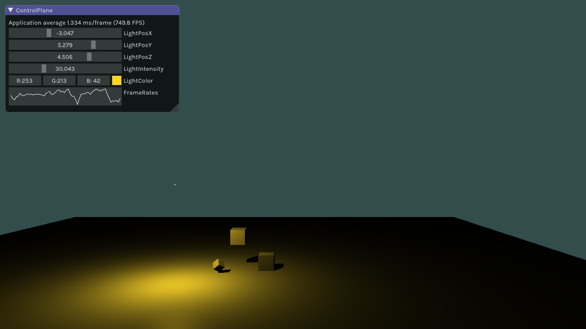

# LearnOpenGL
Personal Learning of OpenGL; Reference: https://learnopengl-cn.github.io/


### 安装和配置运行环境(Windows环境)

使用vcpkg安装环境所需库。

+ **使用环境**
  
  + Windows系统
  + Visual Studio
  + Git
  + CMake
  
+ **配置vcpkg**

  1）下载vcpkg

  ```
  > git clone https://github.com/Microsoft/vcpkg.git
  ```

  2）下载完成后，使用cmd/powershell进入该文件路径（以管理员身份），执行指令

  ```
  PS> .\bootstrap-vcpkg.bat
  ```

  3）执行

  ```
  PS> .\vcpkg integrate install
  ```

+ **安装各种运行库**

  + OpenGL

    执行

    ```
    PS> .\vcpkg install opengl
    ```

    【注】

    1）可以通过search指令列出所有支持的库

    ```
    PS> .\vcpkg search
    ```

    2）在安装前，如不确定该库是否支持，可以通过以下指令查询

    ```
    PS> .\vcpkg search opengl
    ```

    3）安装时，如需指定版本，可参考如下方法：

    ```
    PS> .\vcpkg install opengl:x86-windows
    ```

  + GLFW

    ```
    PS> .\vcpkg install glfw3
    ```

  + GLM

    ```
    PS> .\vcpkg install glm
    ```

  + ASSIMP

    ```
    PS> .\vcpkg install assimp
    ```

  + STB

    ```
    PS> .\vcpkg install stb
    ```

  + GLEW

    ```
    PS> .\vcpkg install glew
    ```

  + GLI

    ```
    PS> .\vcpkg install gli
    ```

    

+ **配置imgui**

vcpkg安装的imgui会有问题，因此这里建议自己下载imgui。

在本工程的Common/include中，使用git下载（或者先下载到其他位置，然后复制到Common/include中）

```
git clone https://github.com/ocornut/imgui.git
```

【注】

本工程因为使用的OpenGL+GLEW，而imgui默认使用GL3W，因此在运行之前，需要修改imgui/examples/imgui_impl_opengl3.h：

将第35行的`#define IMGUI_IMPL_OPENGL_LOADER_GL3W`

修改为：`#define IMGUI_IMPL_OPENGL_LOADER_GLEW`，保存即可。


### 部分结果

+ TestCase007(Light_PBR+DynamicLight)：

  

+ TestCase009_D(IBL)

  

+ TestCase011_A(AreaLight_UnirformColor)

  

+ TestCase012_B(Shadow)

  

  

